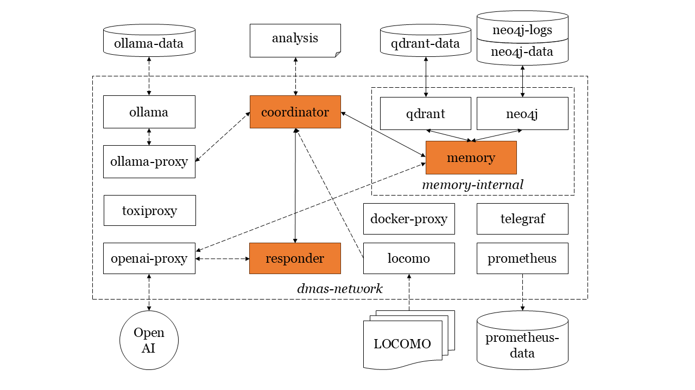

# Cost and accuracy of long-term graph memory in distributed LLM-based multi-agent systems

A distributed multi-agent system testbed for benchmarking vector-based vs. graph-based long-term conversational memory in different network scenarios.



## Overview

This project compares two approaches to persistent memory in LLM-based multi-agent systems:

| Approach          | Backend                                        | Storage | Search Method            |
| ----------------- | ---------------------------------------------- | ------- | ------------------------ |
| **Vector Memory** | [mem0](https://github.com/mem0ai/mem0)         | Qdrant  | Semantic similarity      |
| **Graph Memory**  | [Graphiti](https://github.com/getzep/graphiti) | Neo4j   | Hybrid node search (RRF) |

The system evaluates memory retrieval accuracy on the [LOCOMO benchmark](https://github.com/snap-research/locomo)—a dataset designed for testing very long-term conversational memory in LLM agents.

## Research Context

This repository is the official implementation of a study evaluating long-term memory frameworks in Distributed Multi-Agent Systems (DMAS).

While DMAS leverage Large Language Models (LLMs) for collaborative intelligence, systematic evaluations of their memory under network constraints are often lacking. This project addresses this gap by comparing **mem0** (vector-based) and **Graphiti** (graph-based) using the **LOCOMO** long-context benchmark.

Our research focuses on identifying the optimal balance between computational efficiency and accuracy. By applying a **Statistical Pareto Efficiency** framework, the study evaluates how network conditions, resource consumption, and financial costs influence the choice of memory architecture.
If you use this code or our results in your research, please cite our work.

> **For a detailed breakdown of the methodology and results, please refer to the full paper:**
> 📄 **[Read the Paper (PDF)](./Cost_and_accuracy_of_long_term_graph_memory_in_distributed_LLM_based_multi_agent_systems.pdf)**

## Architecture

The system consists of containerized microservices orchestrated via Docker Compose:

### Services

| Service         | Port      | Description                                                       |
| --------------- | --------- | ----------------------------------------------------------------- |
| **Coordinator** | 8003      | Orchestrates the Q&A pipeline using tool-calling with a local LLM |
| **LOCOMO**      | 8002      | Serves the LOCOMO benchmark dataset (conversations + Q&A pairs)   |
| **Memory**      | 8005      | Abstraction layer for memory backends (mem0 or Graphiti)          |
| **Responder**   | 8006      | Generates final answers using OpenAI GPT models                   |
| **Ollama**      | 11434     | Local LLM inference for the coordinator's tool-calling            |
| **Qdrant**      | 6333      | Vector database for mem0                                          |
| **Neo4j**       | 7474/7687 | Graph database for Graphiti                                       |

### Data Flow

1. **Load Conversation** → LOCOMO dataset is fetched and stored in the memory backend
2. **Ask Question** → Coordinator uses LLM tool-calling to:
   - Call `search_memory` → Memory service retrieves relevant context
   - Call `answer_question` → Responder generates the final answer

## Quick Start

### Prerequisites

- Docker & Docker Compose
- OpenAI API key
- ~16GB RAM recommended (Ollama + Neo4j + Qdrant)

### Setup

1. **Clone the repository**

   ```bash
   git clone https://github.com/your-repo/dmas-long-context-memory.git
   cd dmas-long-context-memory
   ```

2. **Configure environment**

   ```bash
   cp .env.example .env
   ```

   Edit `.env` and set your OpenAI API key:

   ```env
   OPENAI_API_KEY=sk-your-key-here
   MEMORY_BACKEND=graphiti  # or 'mem0'
   OLLAMA_MODEL=qwen2.5:3b-instruct-q4_K_M
   ```

3. **Start all services**

   ```bash
   make up
   ```

4. **Verify services are running**
   ```bash
   make ps
   ```

### Usage

**Load a conversation into memory:**

```bash
curl -X POST http://localhost:8003/load/0
```

**Ask a question:**

```bash
curl -X POST http://localhost:8003/ask \
  -H "Content-Type: application/json" \
  -d '{"question": "What is Alice'\''s favorite food?"}'
```

**Load a specific session:**

```bash
curl -X POST http://localhost:8003/load/0/session/1
```

## Configuration

### Environment Variables

| Variable          | Description                          | Default                       |
| ----------------- | ------------------------------------ | ----------------------------- |
| `OPENAI_API_KEY`  | OpenAI API key for the responder     | Required                      |
| `OPENAI_BASE_URL` | OpenAI API base URL                  | `http://openai-proxy:8001/v1` |
| `MEMORY_BACKEND`  | Memory backend: `mem0` or `graphiti` | `graphiti`                    |
| `OLLAMA_MODEL`    | Local LLM model for coordinator      | `qwen2.5:3b-instruct-q4_K_M`  |
| `OLLAMA_BASE_URL` | Ollama API base URL                  | `http://ollama-proxy:8003/v1` |
| `MODEL`           | OpenAI model for responder           | `gpt-4o`                      |

### Network Fault Injection

The proxy layer supports Toxiproxy-style fault injection for testing resilience:

| Variable           | Description        |
| ------------------ | ------------------ |
| `TOXIC_LATENCY`    | Add latency (ms)   |
| `TOXIC_BANDWIDTH`  | Limit bandwidth    |
| `TOXIC_TIMEOUT`    | Connection timeout |
| `TOXIC_RESET_PEER` | Reset connections  |

## Makefile Commands

| Command      | Description                              |
| ------------ | ---------------------------------------- |
| `make up`    | Build and start all services             |
| `make down`  | Stop all services                        |
| `make build` | Build all Docker images                  |
| `make reset` | Reset all data (preserves Ollama models) |
| `make logs`  | Tail logs from all services              |
| `make ps`    | Show running containers                  |

## Project Structure

```
dmas-long-context-memory/
├── dmas/
│   ├── coordinator/      # Orchestration service
│   ├── locomo/           # LOCOMO benchmark server
│   ├── memory/           # Memory abstraction (mem0/Graphiti)
│   ├── responder/        # Answer generation service
│   └── docker-compose.yml
├── proxy/
│   ├── ollama-proxy/     # Ollama API proxy with metrics
│   ├── openai-proxy/     # OpenAI API proxy with metrics
│   └── docker-compose.yml
├── monitoring/
│   ├── prometheus.yml    # Metrics collection
│   └── telegraf.conf     # System metrics
├── analysis/
│   ├── analysis.ipynb    # Results analysis notebook
│   └── results/          # Benchmark results (CSV)
├── Makefile
└── .env_template
```

## Analysis

Benchmark results are stored in `analysis/results/` and can be analyzed using the provided Jupyter notebook:

```bash
cd analysis
jupyter notebook analysis.ipynb
```

### Metrics Collected

- Memory retrieval accuracy
- Response latency
- Token usage and costs
- Memory storage efficiency

## Evaluation

The final evaluation pipeline, including data extraction, aggregation, normalization, and the generation of statistical plots, is implemented in the evaluation notebook:

```bash
cd analysis
jupyter notebook evaluation.ipynb
```

## References

```bibtex
@article{maharana2024evaluating,
  title={Evaluating very long-term conversational memory of llm agents},
  author={Maharana, Adyasha and Lee, Dong-Ho and Tulyakov, Sergey and Bansal, Mohit and Barbieri, Francesco and Fang, Yuwei},
  journal={arXiv preprint arXiv:2402.17753},
  year={2024}
}
```

## License

See [LICENSE.txt](LICENSE.txt) for details.
